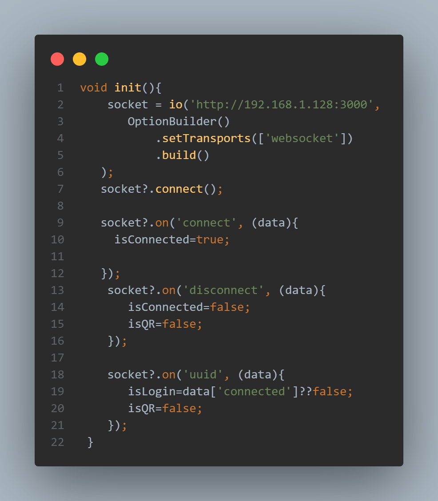

# Mobil Cihazı Gamepad Olarak Kullanma Projesi

Bu proje, mobil cihazınızı bir gamepad olarak kullanmanıza olanak tanır ve NES emülatörü ile entegre bir şekilde oyun oynamanızı sağlar. Aşağıdaki talimatlar, projeyi nasıl kuracağınızı ve çalıştıracağınızı, ayrıca mobil cihazınızı gamepad olarak kullanmaya başlamak için nasıl eşleştirme yapacağınızı açıklamaktadır.

## Proje Gereksinimleri

- Node.js yüklü olmalı.
- Gamepad projesi cihazda yüklü olmalı

[Example](https://kemalyilmaz77.github.io/nes-console/)


## Kurulum

Proje dosyalarını klonladıktan sonra gerekli bağımlılıkları yüklemek için terminalden aşağıdaki komutu çalıştırın:

```bash
npm install
```

## Çalıştırma
Bu nes emülator un web arayüzü vuejs

```bash
npm run dev
```
Bu sunucu gamepad ve webclient in veri aktarımı için

```bash
npm run server
```


## Gamepad
negamepad klasörünün içinde flutter projesi dart diliyle yazıldı

providers/main_provider.dart dosyasını kendi local ipnize göre düzenleyin yada neserver sunucuda çalıstırıcaksanız sunucu ipsini ayarlayın





